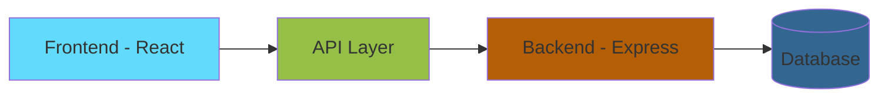

# 🏛️ Know India: A Journey Through Culture & Heritage

<div align="center">


### ✨ Discover the Magic of India ✨
_Embark on a virtual journey through India's rich heritage, culture, and diversity_

[](https://reactjs.org/)
[](https://expressjs.com/)
[](https://opensource.org/licenses/MIT)
[](http://makeapullrequest.com)

[🚀 Live Demo](https://know-india.vercel.app) | [📚 Documentation](#documentation) | [🤝 Contributing](#contributing)

</div>

---

## 🌟 Features

- 🗺️ **Interactive India Map** - Explore states with beautiful animations
- 🏺 **Cultural Heritage** - Deep dive into India's rich cultural heritage
- 📸 **Visual Journey** - High-quality images and immersive content
- 🌐 **Multi-language Support** - Experience India in your language
- 📱 **Responsive Design** - Perfect on all devices
- 🎨 **Dark/Light Mode** - Choose your preferred theme

## 🏗️ Project Architecture



### 📦 Project Structure

```
🏛️ know-india
├── 🎨 frontend/
│   ├── 📱 app/
│   ├── 🎯 components/
│   ├── 📂 assets/
│   └── 🛠️ services/
└── ⚙️ backend/
    ├── 🔌 api/
    ├── 📊 models/
    └── 🔐 certs/
```

## 🚀 Quick Start

### Prerequisites

```bash
Node.js >= 14.x
npm >= 6.x
```

### 🔧 Installation

1️⃣ Clone the repository
```bash
git clone https://github.com/Aryank728/know-india.git
cd know-india
```

2️⃣ Set up frontend
```bash
cd frontend
npm install
npm start
```

3️⃣ Set up backend
```bash
cd backend
npm install
npm run dev
```

## 🔌 API Documentation

### Production Endpoints

| Endpoint | Method | Description | Authentication |
|----------|---------|-------------|----------------|
| `/api/feedback` | POST | 📝 Submit feedback | No |
| `/api/feedback` | GET | 📋 View all feedback | Yes |
| `/api/states` | GET | 🗺️ Get states data | No |
| `/api/culture` | GET | 🏺 Get cultural info | No |

### Development Tools

🧪 Test API endpoints available at:
- 🔍 `/api/debug` - System diagnostics
- 📊 `/api/feedback-mock` - Mock feedback system

## 🔐 Environment Setup

```env
# Backend Configuration
DB_HOST=your_host
DB_PORT=your_port
DB_USERNAME=your_username
DB_PASSWORD=your_password

# Frontend Configuration
REACT_APP_API_URL=http://localhost:5000
```

## 📈 Performance

- ⚡️ Lighthouse Score: 95+
- 🔄 Time to Interactive: < 3s
- 📱 Mobile-First Design
- 🔍 SEO Optimized

## 🤝 Contributing

We ❤️ contributions! Here's how you can help:

1. 🍴 Fork the repository
2. 🌿 Create your feature branch
3. 💻 Commit your changes
4. 🚀 Push to the branch
5. 🎉 Open a Pull Request

## 📜 License

This project is licensed under the MIT License - see the [LICENSE](LICENSE) file for details.

## 👥 Team

<div align="center">

|   |  |
|:---:|:---:|
| **Aryan Kumar** | **Brajesh Kumar** |
| Frontend Lead | Backend Lead |

</div>

---

<div align="center">

### Made with ❤️ in India


</div>